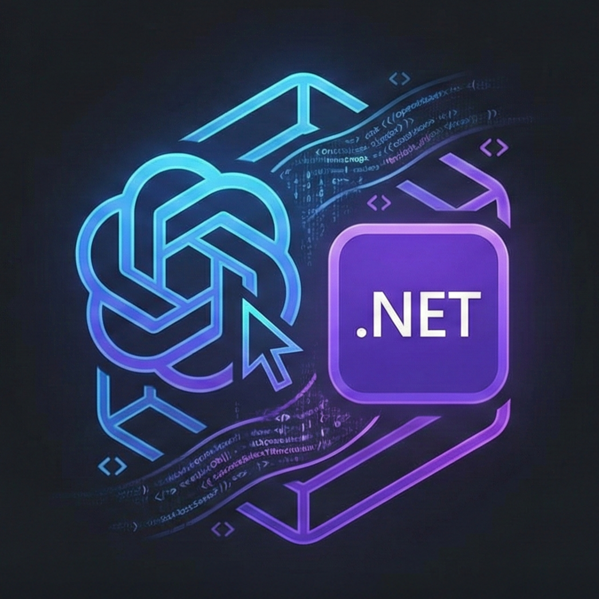

#  JKToolKit.CodexSDK

[](https://github.com/JKamsker/JKToolKit.CodexSDK/actions/workflows/ci.yml) [](https://www.nuget.org/packages/JKToolKit.CodexSDK)

<br clear="left"/>

A strongly-typed .NET SDK for the **Codex CLI** — launch it as a subprocess, stream events, and build integrations with a clean async API.

## Three Integration Modes

| Mode | Best for | Docs |
|------|----------|------|
| **`codex exec`** | Stream JSONL session events from normal Codex runs | [Exec docs](docs/exec.md) |
| **`codex app-server`** | Deep, event-driven integrations (threads / turns / streaming deltas) | [App Server docs](docs/AppServer/README.md) |
| **`codex mcp-server`** | Using Codex as an MCP tool provider | [MCP Server docs](docs/McpServer/README.md) |

## Install

```bash
dotnet add package JKToolKit.CodexSDK
```

> **Prerequisites:** .NET 10+ and Codex CLI on your PATH.

## Quickstart

```csharp
using JKToolKit.CodexSDK;
using JKToolKit.CodexSDK.Models;

await using var sdk = CodexSdk.Create();

// --- Exec mode: stream session events ---
await using var session = await sdk.Exec.StartSessionAsync(
    new CodexSessionOptions("<workdir>", "Write a hello world program")
    {
        Model = CodexModel.Gpt51Codex
    });

await foreach (var evt in session.GetEventsAsync())
{
    Console.WriteLine(evt);
}

// --- App Server: threads + turns + streaming deltas ---
await using var app = await sdk.AppServer.StartAsync();

// --- MCP Server: tool discovery + invocation ---
await using var mcp = await sdk.McpServer.StartAsync();
```

## Documentation

Full docs, examples, and API reference live in [`docs/`](docs/README.md):

- [Exec mode](docs/exec.md) — sessions, streaming events, structured outputs, code reviews
- [App Server](docs/AppServer/README.md) — threads, turns, approvals, DI, resiliency
- [MCP Server](docs/McpServer/README.md) — tool discovery, sessions, follow-ups

## Demo

```bash
dotnet run --project src/JKToolKit.CodexSDK.Demo -- "Your prompt here"
```

See more demo commands in the [full docs](docs/README.md#demos).

## License & Contributing

Contributions welcome — open issues or pull requests for bugs, features, or docs.
